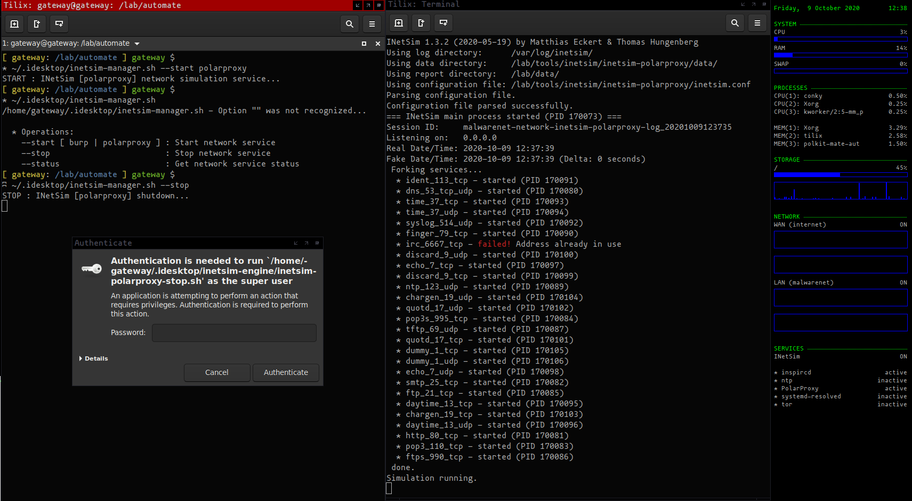

# inetsim-manager

INetSim bash helper scripts to manage INetSim with Burp or PolarProxy proxies... Directory "extra" has example configuration files for PolarProxy.service, inspircd.conf, inetsim-*.conf.

1. Define iptables redirection rules for ports you want
2. Define proxy mappings
3. Launch service

**Note:**
Burp doesn't decrypt traffic, PolarProxy does!

**Traffic flow:**
```
<-----<-----<-----<-----<-----<-----<-----<-----<-----<---
Gateway Machine <-> Proxy <-> IPTables <-> Malware Machine
<-----<-----<-----<-----<-----<-----<-----<-----<-----<---
```
**Decryption:**
* https           443/tcp         http protocol over TLS/SSL
* smtps           465/tcp         smtp protocol over TLS/SSL 
* imaps           993/tcp         imap4 protocol over TLS/SSL
* pop3s           995/tcp         pop3 protocol over TLS/SSL
* ftps            990/tcp         ftp, control, over TLS/SSL

<br>



**Operations:**

`--start [ burp | polarproxy ] : Start network service`

`--stop                        : Stop network service`

`--status                      : Get network service status`

**Files (BURP):**

- `inetsim-burp-start.sh`: Startup (services, iptables, etc...)

- `inetsim-burp-stop.sh`: Tear-down

**Files (POLARPROXY):**

- `inetsim-polarproxy-start.sh`: Startup (services, iptables, etc...)

- `inetsim-polarproxy-stop.sh`: Tear-down